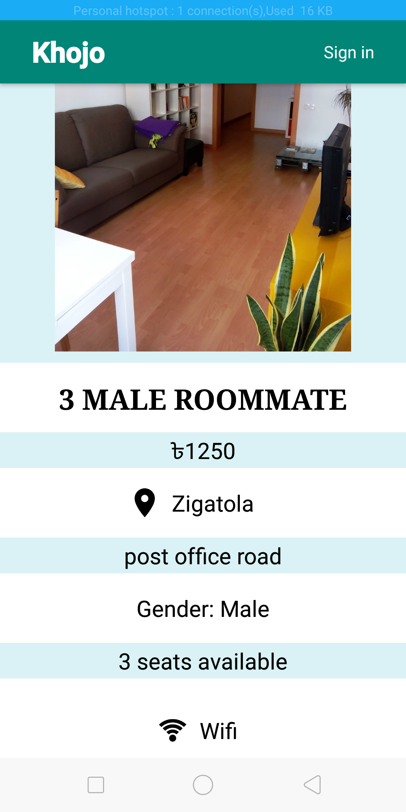

# Khojo

## Overview  
Khojo is an android application for finding available residential spaces in Dhaka city.  
Keeping in mind, the increasing demand for accommodation in the city, we plan to develop the prospect for an easy access to the news and views of vacant flats, hostels, sub-lets, to-lets, rentable office rooms, shops or show rooms.  Using this app, one can both advertise and search for their respective residence of choice.  

## Sub-Systems  
-Authentication  
-Advertisement  
-Searching  
-Maintenance  
-Feedback  

## User-Interface

  
## Use-Case diagrams  
### Authentication Subsystem  
  
### Advertisement Subsystem  
  
### Searching Subsystem  
  
### Maintenance Subsystem  
  
### Feedback Subsystem  
  
